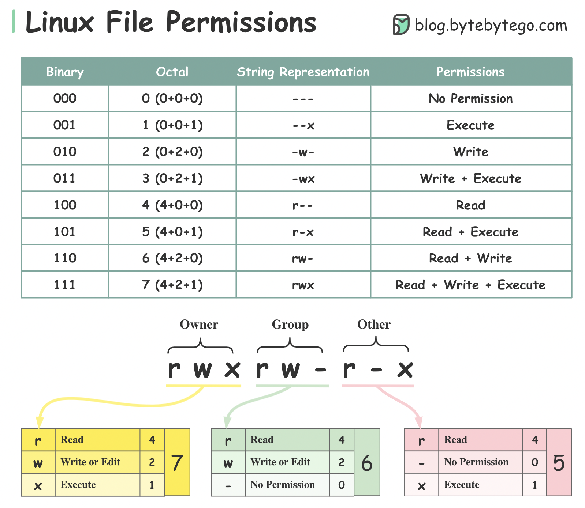

# Linux Fundamentals 1 & 2 & 3

---
__System commands:__

| Command                      | Description                                                                                                    |
| ---------------------------- | -------------------------------------------------------------------------------------------------------------- |
| whoami                       | tells you who you are on the system                                                                            |
| echo "Output text here"      | prints out output message                                                                                      |
| chmod [permissions] [file]   | changes file [permissions](#permissions) (e.g. chmod +x script.py) or use numbers                              |
| su user2                     | changes to user2                                                                                               |
| ps                           | shows system processes                                                                                         |
| ps aux                       | shows system processes. all users + more info + system processes and background sessions                       |
| kill [PID]                   | kill process (SIGTERM - allows cleanup)                                                                        |
| kill -9 [PID]                | kill process (SIGKILL - no cleanup)                                                                            |
| kill -19 [PID]               | stop process (SIGSTOP)                                                                                         |
| systemctl [option] [service] | tool to manage system and services. Options: start, stop, enable, disable, status. E.g. systemctl stop apache2 |

---

__Working on files:__

| Command                 | Description                                                                    |
| ----------------------- | ------------------------------------------------------------------------------ |
| ls                      | shows current files in folder                                                  |
| ls -lah                 | shows current files in folder, show properties + hidden files + human readable |
| cd [path]               | changes directory to selected path                                             |
| cat [file.txt]          | prints content of a file                                                       |
| pwd                     | prints working directory                                                       |
| find -name [file_name}] | searches for files by name                                                     |
| grep "text" [file]      | searches for text inside a file                                                |
| man [command]           | shows man page for command                                                     |
| touch [name]            | creates a file                                                                 |
| nano [name]             | opens or creates a file for editing                                            |
| mkdir [name]            | makes directory                                                                |
| rm [file]               | removes file                                                                   |
| rm -rf [file]           | removes files/directories recursively and forcefully (works on folders)        |
| cp [file] [destination] | copies file to destination                                                     |

---

__Other:__

| Command                        | Description                                                                                                |
| ------------------------------ | ---------------------------------------------------------------------------------------------------------- |
| ssh [name]@[ip]                | connects to a remote machine via SSH                                                                       |
| scp [name]@[ip]:[path_to_file] | downloads via ssh                                                                                          |
| wget [web_path]                | download files from web (HTTP or HTTPS)                                                                    |
| python 3 -m http.server        | sets up http server in current directory. Then you can use wget to download from server on another machine |

---

__Operators spreadsheet:__

| Operator | Description                                                                         |
| -------- | ----------------------------------------------------------------------------------- |
| &        | runs command in background (put it at the end of a command)                         |
| &&       | used between 2 commands, but waits for the first command to finish, before the next |
| >        | redirects output and overwrites (example: echo "this text go into" > file.txt)      |
| >>       | the same thing but it appends instead of overwriting                                |

---
#### Folders:

| Folder | Info                                                                    |
| ------ | ----------------------------------------------------------------------- |
| /var   | root folder. Stores data used by the system, services, and applications |
| /root  | root folder. Home directory of system administrator                     |
| /tmp   | stores temporary files                                                  |

---
#### Permissions:

> source: https://bytebytego.com/guides/linux-file-permission-illustrated/

---
#### Cron:

Cron is a built-in time-based job scheduler. It automatically executes tasks at specified times
Cron - process
Crontab - list of crons

To enter crontab use: crontab -e