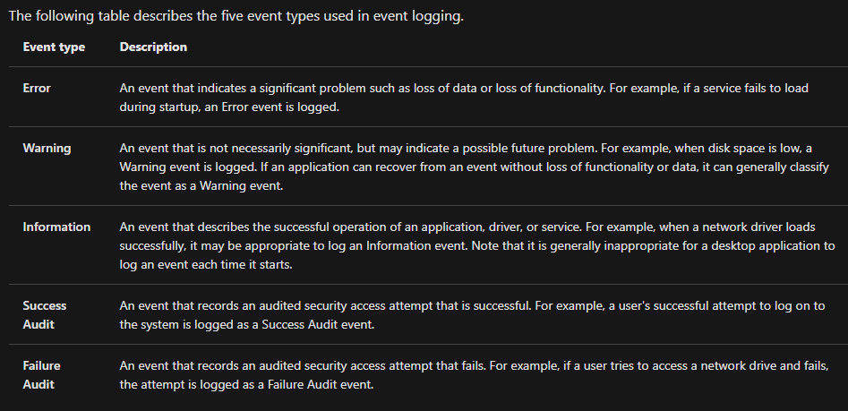
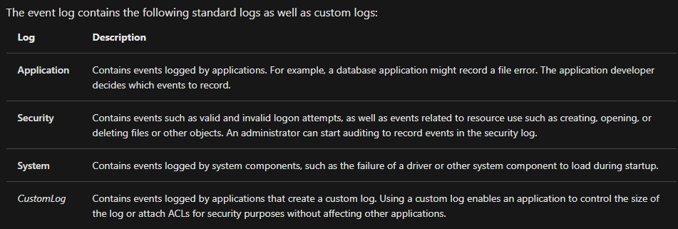

# Windows
Windows file system is NTFS (New Technology File System). It supports files bigger than 4GB (which is more that previous FAT). It also supports ADS (Alternate Data Streams): allows a file to contain multiple, hidden streams of data in addition to its main content.
Windows folder that hold most critical files is system32

## File permissions
To change file permissions: properties -> security -> edit

![[permissions_windows.png]]

## Windows configuration

To enter type msconfig (System Configuration). There are many tabs:

| Tab / Element | Description                                               |
| :------------ | :-------------------------------------------------------- |
| General       | We can choose which services and startup options are used |
| Boot          | Windows boot options.                                     |
| Services      | Applications that run in the background.                  |
| Startup       | Apps on system startup.                                   |
| Tools         | Configure the operating system with various tools.        |

## Important tools

Computer Management (compmgmt) holds most useful tools. Most important:

| Tool           | Description                                                                 |
| :------------- | :-------------------------------------------------------------------------- |
| Task Scheduler | automatically do tasks at given time                                        |
| Event viewer   | record events, used to diagnose problems and actions. __Screenshots below__ |
| Shared Folders | used to list and manage shared folders                                      |
| Device manager | allows to configure and manage hardware                                     |
#### Event viewer info:

Another useful tool is System Information (msinfo32), which shows detailed information about the system. There is also windows Registry - database used to store information about system and application configuration

## Security
- Windows uses TPM (Trusted Platform Module). It is a secure crypto-processor that is designed to carry out cryptographic operations.
- Windows uses BitLocker Drive Encryption. It is a full-disk encryption feature that protects data by encrypting the contents of a drive.
- Volume Shadow Copy Service (VSS) - creates snapshots of volumes, which can be used for backups and system restore