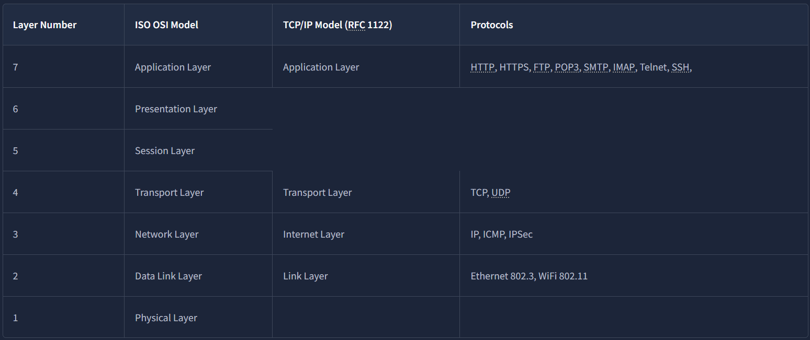
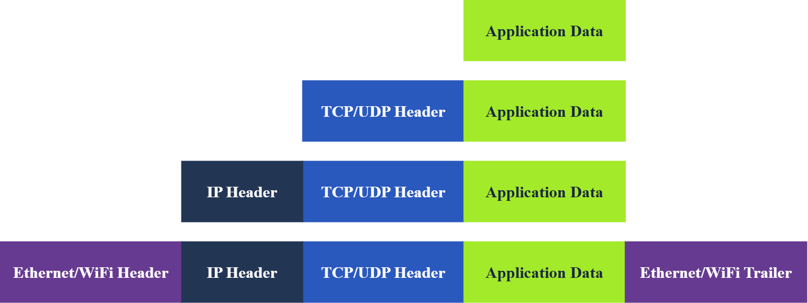

# Networking Concepts

---

### OSI Model

OSI (Open Systems Interconnection) model - explains how computers communicate over a network. It is mostly theoretical but helps understand networking.

1. Physical Layer
2. Data Link Layer
3. Network Layer
4. Transport Layer
5. Session Layer
6. Presentation Layer
7. Application Layer

To help remember:  “Please Do Not Throw Spinach Pizza Away.”

| Layer                  | Description                                                                                                                                                                                                                                                                 |
| ---------------------- | --------------------------------------------------------------------------------------------------------------------------------------------------------------------------------------------------------------------------------------------------------------------------- |
| (1) Physical Layer     | physical connection between devices (==data cables== or antennas), data transmission (electrical, optical, or wireless signal)                                                                                                                                              |
| (2) Data Link Layer    | represents the protocol that enables data transfer between nodes on the same network.  The data link layer describes an agreement between the different systems on the same network segment on how to communicate. ==Examples: Ethernet, Wi-Fi (IEEE 802.11), MAC address== |
| (3) Network Layer      | is concerned with sending data between different networks. Handles logical addressing and routing: finding a path to transfer the network packets between the diverse networks. Examples: ==IP, IPv4, IPv6, ICMP, VPN.==                                                    |
| (4) Transport Layer    | enables end-to-end communication between running applications on different hosts. Examples: ==TCP, UDP==                                                                                                                                                                    |
| (5) Session Layer      | Establishing, maintaining, and synchronising sessions: Network File system (NFS) and Remote Procedure Call (RPC).                                                                                                                                                           |
| (6) Presentation Layer | handles data encoding, compression, and encryption. Example: character encoding (==ASCII, UTF-8==), Multimedia Compression (==JPEG, GIF==), ...                                                                                                                             |
| (7) Application Layer  | Providing services and interfaces to applications. Examples: ==HTTP, FTP, DNS, POP3, SMTP, IMAP==                                                                                                                                                                           |

---

### TCP/IP model

TCP/IP (Transmission Control Protocol/Internet Protocol) - is a 4-layer practical protocol suite that powers the real-world Internet while OSI model is a 7-layer theoretical framework used for education and standardization

---

### IP addresses

An IP address is a unique identifier assigned to a device (host) on a network. It allows devices to find and communicate with each other. There are two main versions: **IPv4** and **IPv6**:

1. ***IPv4 (private network):***
- **Length:** 32 bits = 4 bytes
- **Format:** 4 decimal numbers separated by dots  
    Example: `192.168.1.10`
- **Range:** `0.0.0.0 – 255.255.255.255`
- **Structure:** **Network part + Host part**, determined by the subnet mask/prefix
- **Private address ranges:**
    - `10.0.0.0/8`
    - `172.16.0.0/12`
    - `192.168.0.0/16`
- **Example:** `192.168.1.10/24`
    - Network: `192.168.1.0`
    - Host: `10`
    - Mask: `255.255.255.0`
    
1. ***IPv6 (public network):***
- **Length:** 128 bits = 16 bytes
- **Format:** 8 groups of hexadecimal numbers  
    Example: `2001:db8:abcd:1234:0000:0000:0000:0001`
- **Range:** `:: – ffff:ffff:ffff:ffff:ffff:ffff:ffff:ffff`
- **Shortening:** Consecutive zeros can be replaced with `::`  
    Example: `2001:db8::1`
- **Global unicast addresses:** `2000::/3`
- IPv6 generally does **not require NAT**; devices can have globally routable addresses.

---
### TCP and UDP

1. **TCP** (Transmission Control Protocol) - Provides reliable data delivery between processes. A TCP connection must be established before data is sent. Uses Three-Way Handshake:
	1. **SYN** -> Client requests a connection and sends its initial sequence number.
	2. **SYN-ACK** → Server responds and sends its own initial sequence number.
	3. **ACK** → Client acknowledges the server's response.

2. **UDP** (User Datagram Protocol) - Delivers data to a specific process/application using a port number. No connection establishment is required before sending data. No delivery confirmation. Fast and lightweight because there is no connection setup or delivery confirmation

TCP = Reliable, connection-oriented, but more overhead.
UDP = Fast, simple, but unreliable.

---

### Encapsulation

Encapsulation is the process where each network layer adds a header (and sometimes a trailer) to the data received from the layer above.

#### Life of a Packet:

1. **Application:** Browser creates an **HTTP/HTTPS request**.
2. **Transport:** TCP establishes a connection using the **3-way handshake** and sends the request in TCP segments.
3. **Network:** IP adds the **source and destination IP addresses**, creating an IP packet.
4. **Data Link:** Ethernet/Wi-Fi adds a **header and trailer**, creating a frame.
5. **Router:** Receives the frame, removes the Data Link header/trailer, and **checks the destination IP**.
6. **Routing:** The router forwards the packet to the appropriate network. This process is repeated by other routers until the packet reaches the destination network.
7. **Destination:** The process is reversed (**decapsulation**) until the application receives the original data.

---
### Telnet

Telnet -  network protocol for remote terminal connection. it transmits all in unencrypted cleartext. Usage: `telnet [IP] [PORT]`. Telnet default port number is **23**.